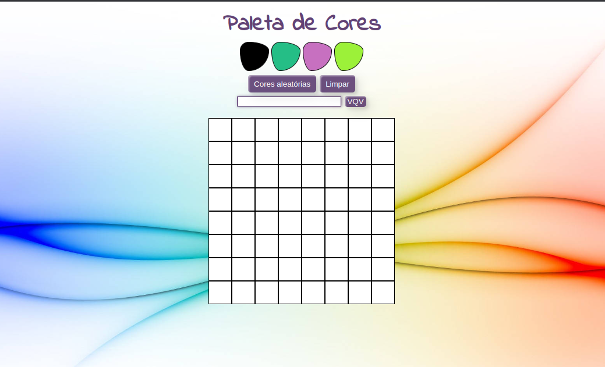

# README: Pixels Art



[Page link](https://feduarte-dev.github.io/pixels-art/)

## Project Description

This project was a real challenge for me. I needed to dynamically create a grid and fill it with colors. Additionally, I created an input through which the user could choose the grid size.

### Technologies

- LINUX
- VSCODE
- HTML
- CSS
- JAVASCRIPT

### What I Learned

- How to use local storage
- How to make a whole page using javascript

## How to Run the Project

1. Clone the repository:

   ```bash
   git clone https://github.com/feduarte-dev/pixels-art
   ```

2. Navigate to the project directory:

   ```bash
   cd your-repository
   ```

3. Install dependencies:

   ```bash
   npm install
   ```

4. Right click index.html and open it with live server

## Contributions

[Felipe](https://www.linkedin.com/in/feduarte-dev/) - index.html - style.css - script.js


[Trybe](https://www.betrybe.com/) - Everything else
